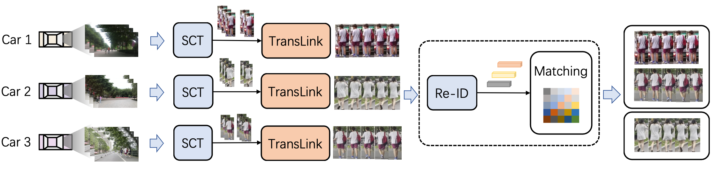

# MMCT

A simple baseline for multi-target multi-moving-camera tracking:

> [**Towards Effective Multi-Moving Camera Tracking: A New Dataset and Lightweight Link Model**](http://arxiv.org/abs/2004.01888),            
> Yanting Zhang, Shuanghong Wang, Qingxiang Wang, Cairong Yan,Rui Fan,        
> *([arXiv 2312.11035](http://arxiv.org/abs/2312.11035))* *([Project webpage](https://dhu-mmct.github.io/))*
## Abstract
Ensuring driving safety for autonomous vehicles has become increasingly crucial, highlighting the need for systematic tracking of pedestrians on the road. Most vehicles are equipped with visual sensors, however, the large-scale visual dataset from different agents has not been well studied yet. Basically, most of the multi-target multi-camera (MTMC) tracking systems are composed of two modules: single camera tracking (SCT) and inter-camera tracking (ICT). To reliably coordinate between them, MTMC tracking has been a very complicated task, while tracking across multi-moving cameras makes it even more challenging. In this paper, we focus on multi-target multi-moving camera (MTMMC) tracking, which is attracting increasing attention from the research community. Observing there are few datasets for MTMMC tracking, we collect a new dataset, called Multi-Moving Camera Track (MMCT), which contains sequences under various driving scenarios. To address the common problems of identity switch easily faced by most existing SCT trackers, especially for moving cameras due to ego-motion between the camera and targets, a lightweight appearance-free global link model, called Linker, is proposed to mitigate the identity switch by associating two disjoint tracklets of the same target into a complete trajectory within the same camera. Incorporated with Linker, existing SCT trackers generally obtain a significant improvement. Moreover, a strong baseline approach of re-identification (Re-ID) is effectively incorporated to extract robust appearance features under varying surroundings for pedestrian association across moving cameras for ICT, resulting in a much improved MTMMC tracking system, which can constitute a step further towards coordinated mining of multiple moving cameras.


## Installation

Please follow the Installation of [FairMOT](https://github.com/ifzhang/FairMOT).

## Data preparation
Please refer to ```README_DATASET``` for details. The download link is [here](https://huggingface.co/datasets/jellyShuang/MMCT).

## Tracking

* Obtain tracking results for **single camera tracking**
1. Run `bash run_img.sh`, and get the tracking results and feature files (.pickle) under single camera 
```bash
bash src/run_img.sh
```
Examples of tracking results are as follows：
```text
1,1,970.9640502929688,595.5170288085938,31.15667724609375,69.88330078125,1,-1,-1,-1
```

2. Run `eval_motchallenge.py` to calculate the metrics for single camera tracking: defined `goundtruth` and `tests` as your own path.
```python
python eval_motchallenge.py
```

* Obtain tracking results for **multi-camera tracking** by following several steps below:
1. Run ```bash src/generate_cpd.sh``` to get the matching file (the input is the pickle feature file. If using Re-ID features for cross-camera association, run `bash fast-reid-master/gen_feat.sh` first)
```bash
# optional
bash fast-reid-master/gen_feat.sh
# generate the matching results
bash generate_cpd.sh
```
2. Run ```bash src/generate_ts.sh``` and ```bash src/cpd.sh``` to get the required directory results. You can copy these two files to your own directory (put the ts generated under the single camera into the corresponding folder as required, ```cpd.sh```generates the corresponding directory structure)
```bash
# get the corresponding directory structure
bash generate_ts.sh
bash cpd.sh
```
3. Run ```bash src/generate_GT.sh``` to get tracking results under multiple cameras.
```bash
bash generate_GT.sh
```
4. Calculate the metrics for multi-camera tracking by running ```python eval-mtmc.py gt ts``` (``gt`` is the groundtruth folder, ``ts`` is the tracking results folder under multiple cameras)
```python
python eval-mtmc.py gt ts
```

## Acknowledgement
A large part of the code is borrowed from [ifzhang/FairMOT](https://github.com/ifzhang/FairMOT). Thanks for their wonderful works.

## Citation

```
@article{zhang2023multi,
   title={Multi-Moving Camera Pedestrian Tracking with a New Dataset and Global Link Model},
   author={Zhang, Yanting and Wang, Shuanghong and Wang, Qingxiang and Yan, Cairong and Fan, Rui},
   journal={arXiv preprint arXiv:2312.11035},
   year={2023} 
}
```

